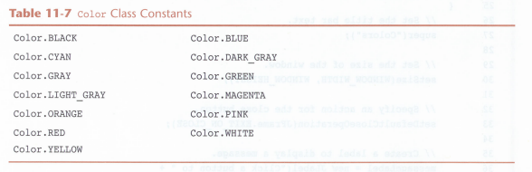

# Unit 2 - Methods

## <u>Colors and Paint</u>

## Colors

### Writing Classes

We have been doing a great job of using classes, but programs aren't written entirely in the main method. They are written across multiple classes which all tie into the main class and main method.

As we progress through using Swing components, we are going to start writing our own classes. Later, we will dive deeper into creating classes and create even more classes. 

At this point, the WAY we code isn't going to change, we are simply changing the structure. So to begin with, we have a class called `ChangingColorsGUI` which will hold most of our code, and another class called `ChangingColors` which will be the main class with the main method.

This allows us to be more versatile and create more listeners and do more with `JPanels`.

It is good practice to start making all GUI programs in this fashion.


### [Built in Colors]()

In the `java.awt` package are a number of color constant you can use to spice up your buttons and panels. 



*Pro-tip: you can also find these colors by simply typing `Color.` and scrolling through the pop-up*

### [Color Methods]()

- `.setForeground(Color)` - sets the foreground color, which is typically the color of the text
- `.setBackground(Color)` - sets the background color of a component

Example:
```java
JPanel panel = new JPanel();
panel.setBackground(Color.blue);
```

This will set the panel components background blue.

### [Custom Colors]()

You can create custom colors using RGB format. There are numerous websites useful for finding RBG values and color combinations. One I really like is [Color Hunt](https://colorhunt.co/). 

To use a custom color, you must first create it:

`Color cool_blue = new Color(int r, int g, int b)`

Then use the identifier you chose in place of the color constants.

Example:
```java
JPanel panel = new JPanel();
Color cool_blue = new Color(147,181,198);
panel.setBackground(cool_blue);
```

Let's go to [Changing Colors][code1] and add some color to our panels and buttons.

## Painting Components

The `JPanel` class has another method called `paintComponent` which we can use the graphics engine to create our own drawings, though it does take a little creativity. 

### [Coordinate Plane]()

The orientation, focal point, anchor point or origin point, however you understand it, is the point where the width and height are measured from. In Java, this point is the top left corner on EVERY component. 

Every component has two parts, its position and its size. The position is defined by an `x` and `y` integer. The panel's origin point is used to determine a components position. Since the origin point is the top-left, `x` and `y` are always positive, which `x` determines horizontal position and `y` determines vertical position.

When Java places a component, it places the top-left corner of that component at the `x`, `y` coordinates given. Then, from that point, it will measure the width (horizontal) and the height (vertical).

### [paintComponent Method]()

The `JPanel` class contains a method called `paintComponent(Graphics g)` which uses a `Graphics` object to paint shapes, images and text on the screen. The `paintComponent` method gets called once, when the panel is created. 

### [Graphics Object]()

The `Graphics` object is the powerhouse to creating drawings. This object can run a large number of methods, which I will not list here. Instead, it's much more useful to use the IntelliSense built-in to find the methods you want. You should stick with shapes and text for now. 

Look at the [SimpleDrawingGUI class][code2] and let's get a few shapes to appear. Notice here that we are going to create a private inner class to create our drawing panel.


[code1]: /src/ChangingColorsGUI.java
[code2]: /src/SimpleDrawingGUI.java